<div align="center">

<h3><code>yousuf@github ~ $ whoami</code></h3>

<!-- Portrait + M.Yousuf — ONE terminal window (portrait above, wordmark below) -->


<br>
<br>

<!-- Taglines — continue-writing (type -> erase -> next) below the name -->
<h3><code>yousuf@github ~ $ ./intro.sh</code></h3>

<p><b>Founder · Building the Execution Layer of AI · Free-AI Believer</b></p>


<br>
<br>

<h3><code>yousuf@github ~ $ ./contributions.sh</code></h3>



<br>
<br>

<h3><code>yousuf@github ~ $ ./links.sh</code></h3>

<a href="https://github.com/yousufkidiya17"></a>
<a href="https://www.youtube.com/@yousufkidiya17"></a>
<a href="https://www.linkedin.com/in/yousufkidiya17"></a>

<br>

</div>

---

## 🧠 About Me

**Founder || Building the Execution Layer of AI || Turning Intent into Real-World Actions**

Pursuing **B.TECH from RKDF University, Bhopal (MP)**.

- 🏭 **4+ years** hands-on experience in the commodity & FMCG distribution ecosystem — operations, supply chain dynamics, and ground-level execution
- 📈 **2+ years** exposure to financial markets — risk management, data-driven decision-making, analytical thinking
- 🎯 Currently building a platform that **bridges the gap between user intent and real-world execution** — moving tasks from conversation to completion through a unified interface
- 🤖 I build **AI agents that are FREE and zero-setup** — because AI should be for everyone, not just those with credit cards

<br>

## 🚀 Projects

| Project | What it is |
|---|---|
| **[hermeszen-ai](https://github.com/yousufkidiya17/hermeszen-ai)** | ⭐ Flagship — Zero-setup Hermes AI agent. 7 free models (OpenCode Zen), web search + fetch, vision, 1-click install for Win/macOS/Linux |
| **[hermes-mobile-modified](https://github.com/yousufkidiya17/hermes-mobile-modified)** | Hermes Mobile with embedded engine, terminal, skills & tools — full agent on your phone |
| **[aetherix-ai](https://github.com/yousufkidiya17/aetherix-ai)** | AI-Powered Service Marketplace — order food, book rides, hire workers, check weather & search web through one chat interface (React, TS, Express, Mistral AI) |
| [opencode-local-proxy](https://github.com/yousufkidiya17/opencode-local-proxy) | Portable OpenAI-compatible API gateway — proxies free OpenCode AI models locally, glassmorphic dashboard & playground |
| [opencode-local-api](https://github.com/yousufkidiya17/opencode-local-api) | Supercharge OpenCode AI Agents — terminal access, safe file editing, background tasks & live web search via a lightweight Python API server |
| [smart-trading-scanner](https://github.com/yousufkidiya17/smart-trading-scanner) | Smart Money Concept Scanner for Indian Stocks & Crypto — liquidity sweeps, order blocks, FVGs & institutional flow detection (Python + Streamlit) |
| [train-travel-assistant](https://github.com/yousufkidiya17/train-travel-assistant) | Indian Railway AI Assistant — PNR status, seat availability, live train tracking & fare comparison (Python + Flask + AI) |

<br>

## 🛠 Tech I Work With

         

**AI Models:** DeepSeek · Mimo (vision) · Nemotron · North · Laguna · Big-Pickle · Ling — all via OpenCode Zen free tier

<br>

## 📊 GitHub Stats

<div align="center">


</div>

<br>

## 🧩 Fun Terminal Block

```
yousuf@github ~$ ./hermeszen --install
✅ Hermes + bridge + 7 free models + vision — DONE
yousuf@github ~$ ./hermes --start
⚡ Agent online. Ask anything — no API key, no credit card.
yousuf@github ~$ echo "$(cat /dev/ai_belief)"
→ "Execution Layer of AI — intent se kaam tak" 🚀
```

<br>

## 📣 Let's Connect

<a href="https://www.youtube.com/@yousufkidiya17"></a>
<a href="https://github.com/yousufkidiya17"></a>

**⭐ Star [HermesZen](https://github.com/yousufkidiya17/hermeszen-ai) — free AI, zero setup, sab ke liye!**

<sub>Profile built with ❤️ + Hermes</sub>